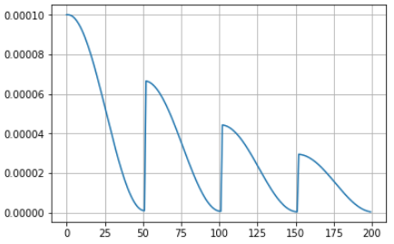
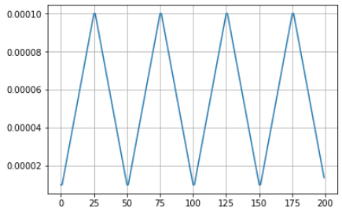
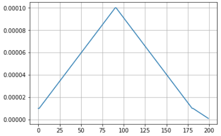

## Learning Rate Scheduler on Pytorch
I add some additional learning rate decay scheduler to the PyTorch original implementation. The implementation details are shown in the example.ipnb. 

#### CosineAnnealingCyclicalLR(SGDR[1])

#### TrangleCyclicalLR(CLS[2])

#### TrangleTailLR

## Reference
[1]Loshchilov, I., & Hutter, F. (2016). SGDR: Stochastic Gradient Descent with Warm Restarts, 1–16. https://doi.org/10.1002/fut

[2]Smith, L. N. (2017). Cyclical learning rates for training neural networks. Proceedings - 2017 IEEE Winter Conference on Applications of Computer Vision, WACV 2017, (April), 464–472. https://doi.org/10.1109/WACV.2017.58